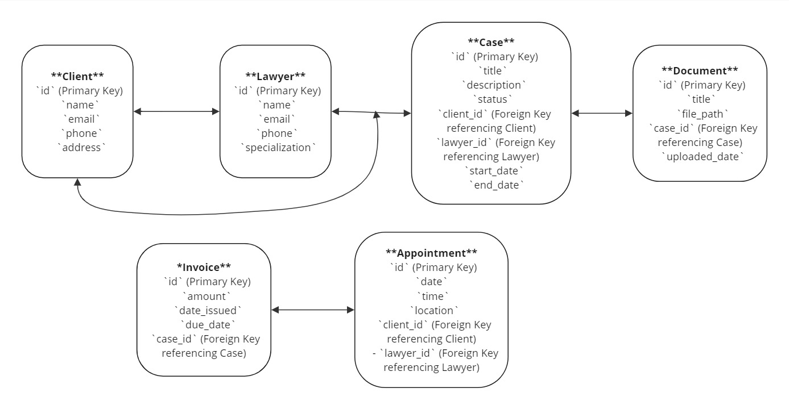

# Client Portal for Culley & McAlpine Solicitors

This project involves developing a client portal for Culley & McAlpine Solicitors, alongside making edits to their WordPress site. A staged version of the site is currently in progress and will be linked here upon completion.

## Technology Stack

The following technologies will be utilized in the development of this web application:

- HTML & CSS
- JavaScript
- React
- Node.js
- Prisma
- SQL

## Features

The following features will be utilized in the development of this web application:

### User Authentication and Authorization

- **User Registration and Login:**
  - Secure registration process with email verification.
  - Multi-factor authentication (MFA) for enhanced security.
- **Role-based Access Control:**
  - Different access levels for clients, solicitors, and administrators.
  - Clients can only access their own case information.

### Case Management

- **Case Dashboard:**
  - Overview of all active and closed cases with status indicators.
  - Quick access to recent activities and updates.
- **Case Details:**
  - Detailed view of each case including case number, reference number, key dates, involved parties, and current status.
  - Upload and download options for related documents (e.g., court orders, evidence, correspondence).

### Communication Tools

- **Secure Messaging:**
  - Encrypted messaging system for clients to communicate with their solicitors.
  - Notification system for new messages and updates.
- **Appointment Scheduling:**
  - Integrated calendar for booking and managing appointments.
  - Reminders and notifications for upcoming appointments.

### Document Management

- **Document Repository:**
  - Secure storage for case-related documents with access controls.
  - Version control and audit trails for document changes.

### Security Features

- **Data Encryption:**
  - SSL/TLS for data in transit.
  - End-to-end encryption for sensitive data.
- **Audit Logs:**
  - Detailed logging of user activities for monitoring and compliance.
- **Compliance:**
  - Adherence to legal and industry standards (e.g., GDPR, HIPAA) for data protection.

### User Experience

- **Responsive Design:**
  - Mobile-friendly interface for access on various devices.
- **User-friendly Interface:**
  - Intuitive navigation and search functionality for ease of use.

### Support and Help

- **Help Center:**
  - FAQ section, user guides, and tutorials.
- **Customer Support:**
  - Integrated support system for assistance (chat, email, phone).

### Administrative Tools

- **Admin Dashboard:**
  - Overview of portal usage, case statistics, and system health.
  - Tools for managing user accounts and permissions.

### Technical Considerations

- **Scalability:**
  - Ability to handle a growing number of users and cases.
- **Performance Optimization:**
  - Efficient loading times and real-time updates.

### Implementation Considerations

- **Integration with Existing Systems:**
  - Compatibility with the solicitors' existing case management and billing systems.
- **Regular Updates and Maintenance:**
  - Continuous improvement and security updates to the portal.

### Additional Features

- **Case Timeline:**
  - Visual representation of case progress and important milestones.
- **Payment Gateway:**
  - Secure system for clients to make payments related to their cases.

## Deployment

The site will be deployed here.

## Domain Model

The following domain model represents the key entities and their relationships within the client portal for Culley & McAlpine Solicitors.

### Entities and Attributes

1. **Client**
   - `id` (Primary Key)
   - `name`
   - `email`
   - `phone`
   - `address`

2. **Lawyer**
   - `id` (Primary Key)
   - `name`
   - `email`
   - `phone`
   - `specialization`

3. **Case**
   - `id` (Primary Key)
   - `title`
   - `description`
   - `status`
   - `client_id` (Foreign Key referencing Client)
   - `lawyer_id` (Foreign Key referencing Lawyer)
   - `start_date`
   - `end_date`

4. **Document**
   - `id` (Primary Key)
   - `title`
   - `file_path`
   - `case_id` (Foreign Key referencing Case)
   - `uploaded_date`

5. **Appointment**
   - `id` (Primary Key)
   - `date`
   - `time`
   - `location`
   - `client_id` (Foreign Key referencing Client)
   - `lawyer_id` (Foreign Key referencing Lawyer)

6. **Invoice**
   - `id` (Primary Key)
   - `amount`
   - `date_issued`
   - `due_date`
   - `case_id` (Foreign Key referencing Case)

## Entity-Relationship Diagram (ERD)

